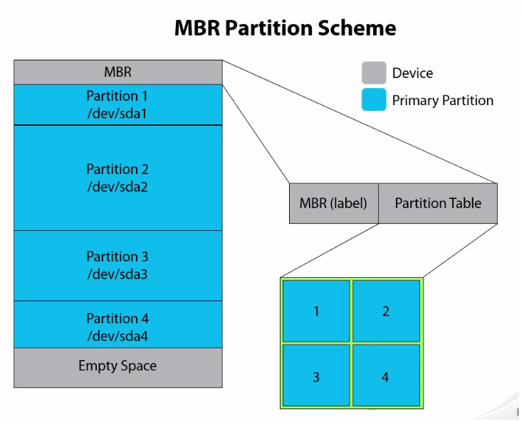
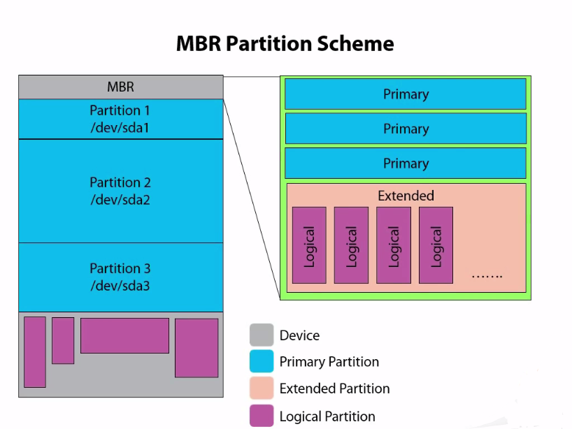
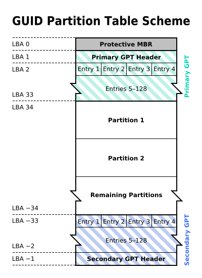
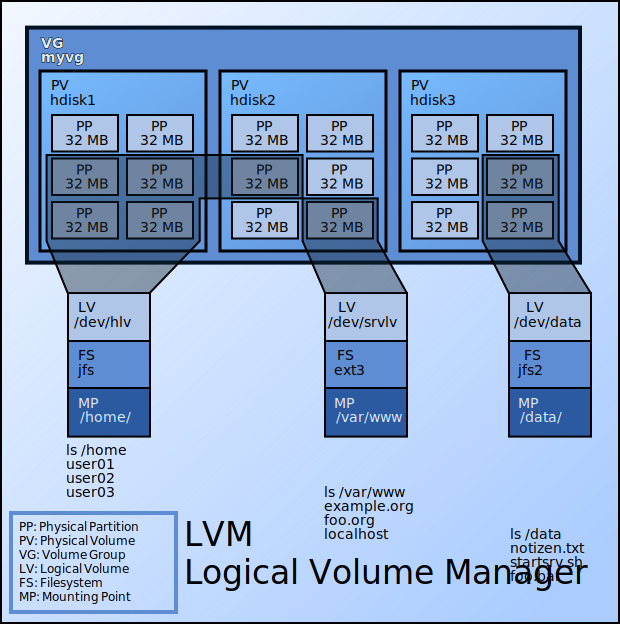

% Provisioning

Block devices
=============

Each hard disk or hardware RAID set appears as a so-called block device.

-   UNIX-like systems show block devices in the `/dev` directory:

    -   Linux show SATA devices as `sd` and a letter, such as
        `/dev/sda`, `/dev/sdb`.

	-   Mac systems show `disk` followed by a number, like `/dev/disk0`.

	-   Varies on other unix-like systems (e.g. Xenix, AIX, BSD)

-   Windows systems will show block devices in the logical disk manager.
    They will *NOT* appear as drive letters!

A filesystem is then setup on the block device by formatting it. The
filesystem organises the block device into the familiar structure of
files and folders. Also the filesystem typically handles permissions and
metadata storage.

Partitioning
============

Partitioning allows us to divide a single block device into a number of
separate segments that each appear as a separate block device. Each
partition can have a different filesystem on it. In almost all cases
fixed disks in PC-based systems are partitioned.

There are a number of partitioning schemes. A few common concepts:

-   A partition table defines one or more partitions on the disk. This
    is located in a known location, usually first block on drive.

    -   [Partition types](https://en.wikipedia.org/wiki/Partition_type).

-   The host’s OS needs to boot usually from a disk. Partition scheme
    needs to be compatible with the BIOS or UEFI to achieve this. Also
    the boot loader may need to be set up.

Most PC-based systems use either MBR or GPT.

Master Boot Record (MBR)
------------------------

MBR is the most common PC partitioning scheme. Introduce circa 1983 with
DOS. This defines up to four primary partitions on a drive, .



-   MBR layout closely linked with BIOS boot process. One partition
    marked “active”.

-   The MBR scheme stores the partition table at the beginning of the
    first 512 bytes of the drive.

    -   446 bytes bootloader, 64 bytes partition table, 2 bytes “magic
        number”

-   MBR limited to drives less than approx 2.2 TB.

Extended Boot Record (EBR)
--------------------------

EBR allows more than four partitions on a drive. One MBR partition is
designated as an extended partition. This *extended partition* can hold
one or more *logical partitions*, .



GUID Partition Table (GPT)
--------------------------

GPT is a more modern scheme and is associated with UEFI-based systems.
UEFI is an alternative to BIOS and is used by newer PCs and Apple Macs.
GPT layout is shown in .



Points to note:

-   GPT can define up to 128 partitions.

-   A so-called *protective MBR* is present in the usual MBR location:

    -   Indicates entire disk is a single MBR partition.

    -   Shows disk partitioning (and other) software that the MBR scheme
        is not in use.

    -   Prevents accidental overwriting by MBR utilities.

-   GPT partition table follows protective MBR.

-   GPT stores redundant copy of partition table at the end of
    the drive.

-   Boot process more complicated than MBR.

Logical volumes
===============

Logical Volumes can sometimes offer a practical alternative to
partitions. Partitioning can be considered as a thick provisioning of
disk space. Logical volumes represent a thin provisioning of disk space.

Unlike partitoning, logical volumes are OS-dependent and their handling
depends on the host OS in use. The general ideas are:

-   Volumes are created which appear to OS as a partition, which are
    then formatted and mounted in the usual way.

-   A single disk is used in its entirety. Usually a single large
    partition is created to hold the logical volumes. Sometimes a small
    standard boot partition is required.

-   Logical Volume manager can resize volumes. For this to work
    non-destructively, file system must support resizing. Useful
    capability when used appropriately.

-   May support snapshot/restore operations.

Linux LVM
---------

Linux has an inbuilt Logical Volume Manager (LVM). LVM is built into the
kernel and managed by a number of commands in `/usr/sbin`.

LVM takes over partitions on physical disks as physical volumes.
Physical volumes are aggregated into volume groups. Logical Volumes,
which act like a partition, are then provisioned on a volume group.

Physical disks

:   appear to the system as block devices.

LVM partitions

:   are created on the physical disk, usually 1 for entire disk. Example
    of creating an LVM partition on entire of `/dev/sda`:

    ``` {.bash}
    # Create a partition table on the drive
    parted -s /dev/sda mklabel gpt
    # Make a primary partition on whole drive
    parted -s /dev/sda unit mib mkpart primary 1 100%
    # Mark it as LVM
    parted -s /dev/sda set 1 lvm on
    ```

    The newly-created LVM partition spanning the whole disk will appear
    as `/dev/sda1`.

Physical volumes

:   map to physical disks. Physical volumes are created on a partition
    using `pvcreate`.

    ``` {.bash}
        pvcreate /dev/sda1
        # similar for another disk / partition
        pvcreate /dev/sdb1
      
    ```

    Commands dealing with physical volumes start with `pv`. For example,
    we can use `pvdisplay` to show information about all physical
    volumes in the system.

Volume group

:   aggregates one or more physical volumes to create a virtual hard
    disk using `vgcreate`. The volume group has a name / label, here
    `vg-01`.

    ``` {.bash}
        # create vg-01 composed of /dev/sda1 and /dev/sdb1
        vgcreate vg01 /dev/sda1 /dev/sdb1
      
    ```

    Commands dealing with volume groups start with `vg`. For example, we
    can use `vgdisplay` to show information about volume groups in the
    system. The volume group will then appear as a directory under
    `/dev`, in this case `/dev/vg01`.

Logical volume

:   is provisioned on the volume group, and acts as a virtual hard disk.

    ``` {.bash}
        # create a 10GB logical volume on vg01 named vol_data
        lvcreate -L 10G -n vol_data vg01
      
    ```

    Commands dealing with logical volumes start with `lv`. For example,
    we can use `lvdisplay` to show information about logical volumes in
    the system. The new logical volume will then appear in the
    `/dev/vg01` folder as `/dev/vg01/vol_data`.



Useful links
============

-   <https://www.digitalocean.com/community/tutorials/an-introduction-to-lvm-concepts-terminology-and-operations>

-   <https://www.server-world.info/en/note?os=Ubuntu_17.04&p=iscsi&f=1>

-   <https://en.wikipedia.org/wiki/Logical_volume_management>
